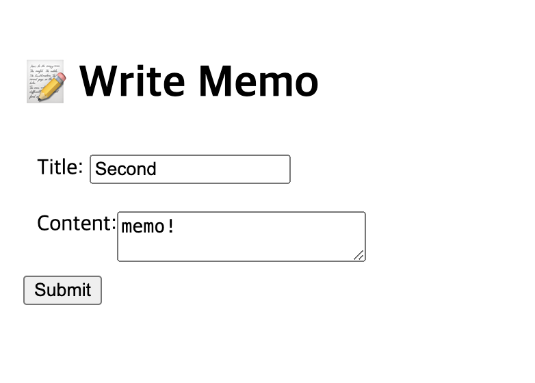
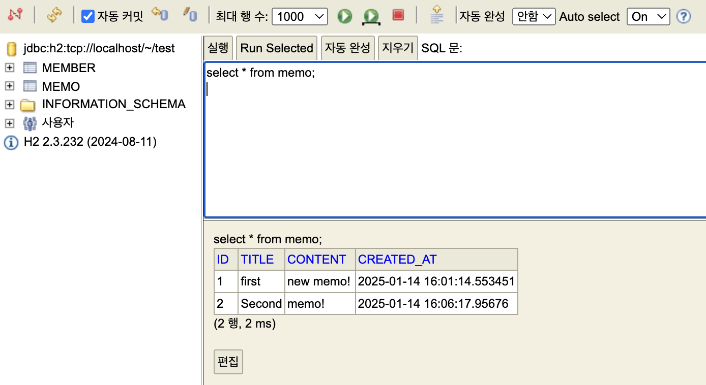

# 📋 Simple Memo Manager

스프링 입문, 스프링 핵심원리 - 기본편 (김영한) 을 듣고,
만들어보는 토이 프로젝트입니다. 

ChatGPT를 통해 프로젝트 내용 및 명세를 설정했습니다.


This is a toy project to practice and apply what I have learned from Spring Introduction and Spring Core Principles - Basics by Kim Young-han.

The project content and specifications were set through ChatGPT.

---

Description: A Spring-based web application that allows users to create view simple memos.

## 🔌 Tech Stack

Language: Java

Framework: Spring Boot 3.4.1

Build Tool: Gradle

Database: H2 (In-memory Database)

Template Engine: Thymeleaf

Java Version: 21

## 👾 Feature Specifications

View Memo List
- [x] Displays a list of memos with their titles and creation dates.

Add Memo
- [x] Allows users to input a title and content to create a new memo.


## 📊 Create Table
```sql
CREATE TABLE memo
(
    id BIGINT GENERATED BY DEFAULT AS IDENTITY,
    title VARCHAR(255),
    content VARCHAR(255),
    created_at TIMESTAMP DEFAULT CURRENT_TIMESTAMP,
    PRIMARY KEY (id)
);
```
## 📷 Execution screenshot





## 🤔Retrospective

During the project, I removed some features because I felt I wasn't fully prepared to implement them yet. I plan to revisit and 
try again after gaining a better understanding of the "Spring MVC pattern."

This project provided a great opportunity to practice key concepts such as Service, Domain, Controller, and Repository. 
Through this experience, I gained a clearer understanding of how Spring processes client requests and interacts with the database.

Additionally, I experimented with Lombok, which significantly simplified and streamlined my code. 
However, I realized I need to deepen my knowledge of JPA, JUnit testing, and the MVC pattern to improve further.


프로젝트 도중 아직 제대로 알고 있지 않다고 느껴 일부 기능을 제거했습니다. "Spring MVC 패턴"에 대해 더 학습한 후 다시 시도할 계획입니다.

이번 프로젝트는 Service, Domain, Controller, Repository와 같은 핵심 개념을 연습할 좋은 기회가 되었습니다. 
이 경험을 통해 Spring이 클라이언트 요청을 처리하고 데이터베이스에 어떻게 적용하는지 더 명확히 이해할 수 있었습니다.

또한, Lombok을 사용해보았는데, 코드가 훨씬 간결해지는 것을 경험할 수 있었습니다. 하지만 JPA, JUnit 테스트, MVC 패턴에 대한 지식을 더 깊이 배워야 
할 필요성을 느꼈습니다.
